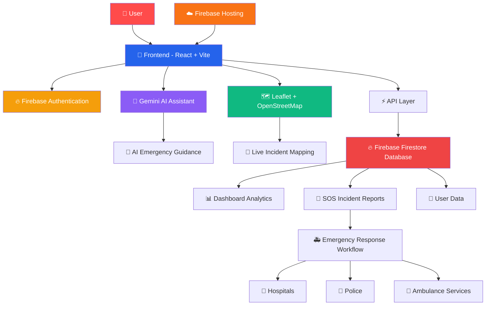

```txt
██████╗  ██████╗  █████╗ ██████╗ ███████╗ ██████╗ ███████╗
██╔══██╗██╔═══██╗██╔══██╗██╔══██╗██╔════╝██╔═══██╗██╔════╝
██████╔╝██║   ██║███████║██║  ██║███████╗██║   ██║███████╗
██╔══██╗██║   ██║██╔══██║██║  ██║╚════██║██║   ██║╚════██║
██║  ██║╚██████╔╝██║  ██║██████╔╝███████║╚██████╔╝███████║
╚═╝  ╚═╝ ╚═════╝ ╚═╝  ╚═╝╚═════╝ ╚══════╝ ╚═════╝ ╚══════╝

        🚨 AI Powered Road Emergency Response System 🚨
```
<p align="center">
  
  
  
  
</p>

---

# 🌟 Overview

**Road-SoS** is an AI-powered road safety and emergency response platform built during a hackathon.

The platform helps users:

- 🚨 Report road incidents
- 🗺️ View live road situations
- 🤖 Get AI-powered emergency assistance
- 📍 Track nearby emergency services
- 🔥 Monitor incidents in real-time

This project is designed as a **Hackathon MVP**, with future scalability and real-world implementation in mind.

---

# 🌐 Live Deployment

🚀 The project is successfully deployed on Firebase Hosting.

🔗 **Live Website:**  
[https://road-safety-hackathon-84069.web.app/](https://road-safety-hackathon-84069.web.app/)

---

# ☁️ Deployment (Firebase Hosting)

This project is deployed using **Firebase Hosting**.

## Build the Project

```bash
pnpm build
```

## Deploy to Firebase

```bash
firebase deploy
```

## Firebase Configuration (`firebase.json`)

```json
{
  "hosting": {
    "public": "dist/public",
    "ignore": [
      "firebase.json",
      "**/.*",
      "**/node_modules/**"
    ],
    "rewrites": [
      {
        "source": "**",
        "destination": "/index.html"
      }
    ]
  }
}
```

---

# 📦 Production Build Output

After running:

```bash
pnpm build
```

Production files are generated inside:

```bash
dist/public
```

---

# 🔥 Hosting Features

✅ Fast global CDN delivery  
✅ HTTPS enabled automatically  
✅ SPA routing support  
✅ Easy redeployment  
✅ Free hosting tier available

---

# ✨ Features

## 🔐 Authentication System

- Firebase Authentication
- Secure Login / Signup
- Session Management
- Protected Routes

---

## 🤖 AI Emergency Assistant

- Gemini AI Integration
- Smart Emergency Suggestions
- Road Safety Guidance
- AI-powered Help Responses

---

## 📊 Live Dashboard

- Real-time Incident Monitoring
- Severity Indicators
- Dynamic Dashboard Updates
- Incident Feed System

---

## 🗺️ Interactive Map

- Live Location Tracking
- Incident Visualization
- Nearby Emergency Services
- Map-based Monitoring

---

## 📱 Responsive Modern UI

- Mobile Friendly
- Glassmorphism Design
- Smooth Animations
- Modern User Experience

---

# 🚀 Future Features

- 📱 Native Mobile Application
- 🌍 Multi-language Support
- 🚑 Emergency Service Integration
- 🔔 Push Notifications
- 📷 AI-based Image Incident Detection
- 🧠 Advanced AI Emergency Predictions
- 📡 Real-time Traffic Analytics
- 👥 Community Reporting System

> ⚡ This project is currently a Hackathon MVP and will continue evolving with more advanced features.

---

# 🛠️ Tech Stack

| Technology | Usage |
|------------|-------|
| React + Vite | Frontend |
| TailwindCSS | Styling |
| Firebase | Authentication & Database |
| Gemini API | AI Integration |
| Leaflet Maps | Live Map System |
| TypeScript | Development |
| PNPM | Package Management |

---

# 📁 Folder Structure

```bash
Road-SoS/
│
├── artifacts/
│   └── roadsos/
│       │
│       ├── src/
│       │   ├── components/
│       │   ├── pages/
│       │   ├── services/
│       │   ├── hooks/
│       │   ├── context/
│       │   ├── lib/
│       │   ├── App.tsx
│       │   ├── main.tsx
│       │   └── index.css
│       │
│       ├── public/
│       │
│       ├── dist/
│       │   └── public/
│       │
│       ├── .env
│       ├── firebase.json
│       ├── vite.config.ts
│       ├── tailwind.config.ts
│       ├── tsconfig.json
│       ├── package.json
│       ├── pnpm-lock.yaml
│       └── README.md
│
├── package.json
├── pnpm-workspace.yaml
└── README.md
```

---

# 🏗️ RoadSoS Workflow Architecture



# ⚙️ Installation & Setup

## 1️⃣ Clone Repository

```bash
git clone https://github.com/parth254012-spec/roadsos.git
```

---

## 2️⃣ Open Project Directory

```bash
cd Road-SoS/artifacts/roadsos
```

---

## 3️⃣ Install Dependencies

```bash
pnpm install
```

---

## 4️⃣ Create `.env` File

Create a `.env` file inside:

```bash
artifacts/roadsos
```

Add the following:

```env
VITE_FIREBASE_API_KEY=your_api_key
VITE_FIREBASE_AUTH_DOMAIN=your_auth_domain
VITE_FIREBASE_PROJECT_ID=your_project_id
VITE_FIREBASE_STORAGE_BUCKET=your_storage_bucket
VITE_FIREBASE_MESSAGING_SENDER_ID=your_messaging_id
VITE_FIREBASE_APP_ID=your_app_id

VITE_GEMINI_API_KEY=your_gemini_key

PORT=3000
BASE_PATH=/
```

⚠️ Never expose your real API keys publicly.  
Use `.env.local` or GitHub Secrets for production deployments.

---

## 5️⃣ Run Development Server

```bash
pnpm run dev
```

App runs on:

```bash
http://localhost:3000
```

---

# 🏗️ Production Build

```bash
pnpm build
```

---

# 🔥 Firebase Deployment

## Login to Firebase

```bash
firebase login
```

## Deploy Project

```bash
firebase deploy
```

---

# 📸 Screenshots

## 🚀 Landing Page


---

## 🏠 Home Page


---

## 🗺️ Live Map


---

## 🚨 SOS Button


---

## 👤 Profile Section


---

## 🤖 AI Assistant & Nearby Services


---

# 🙏 Acknowledgements

Special thanks to:

- Firebase
- Gemini AI
- React Community
- Open Source Contributors
- Hackathon Mentors & Team Members

---

# ⭐ Support

If you liked this project:

⭐ Star the Repository  
🍴 Fork the Project  
🛠️ Contribute to Improve It

---

# 📄 License

This project is created for educational and hackathon purposes.

---

<p align="center">
  Built with ❤️ During Hackathon
</p>
